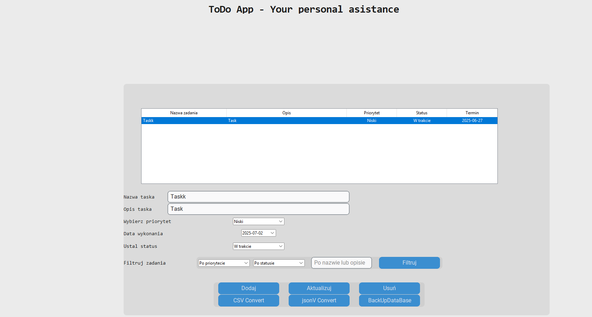

# Too-Doo-App
# 📝 TooDoo App — Task Manager in Python

Task management desktop application built with `tkinter` `customtkinter` and `sqlite3`, designed to help you organize, filter, and manage tasks efficiently. Includes calendar selection, data export, notifications, and database backup functionality.

## 🚀 Features

- ✅ Add, edit, and delete tasks with ease
- 🔍 Search and filter by name, description, priority, status, or due date
- 🎨 Priority color coding (green = low, orange = medium, red = high)
- 📅 Integrated calendar for setting deadlines
- 💾 Export to `.csv` or `.json`
- 🗂️ Automatic database backups
- 🔔 Reminder popups for tasks due today
- 📁 Persistent storage using `sqlite3`
- 🌙 Built with `CustomTkinter` for modern UI

## 🛠️ Technologies Used
Python 3

- customtkinter
- tkcalendar for date selection
- sqlite3 as database backend
- csv and json for exports
- shutil for database backups
- ttk.Treeview for task display

## 📸 Screenshot

